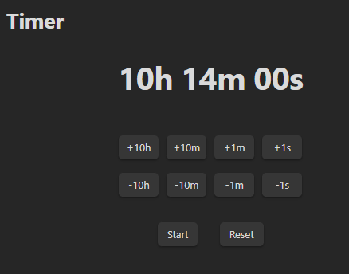
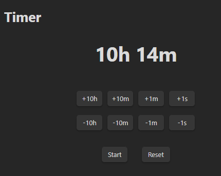

# Obsidian-Timer-Plugin

With this plugin you can measure time, set timers and get a notice if the timer is done.


## Using
Set your timer via commands or with the timer buttons under the clock. The maximum is ``99:59:59``. Also if the clock is at ``00:00:00`` the timer is not starting. You can edit the numbers which in-/decreases the clock in the settings. If the timer is finished you get a notice. You can ``start/stop/cancel/resume and reset`` the timer. By default you can start and reset the timer, but if the timer is going you can cancel/stop/resume it.

You also see the current timer in the status bar in the left corner.
Also there is another time format called ``Verbose`` (screenshots with stacked timer buttons): 

With not set values | Without not set values (00)|
--- | --- |
 |  |

## Commands 
You can open the timer by clicking on the ribbon icon or using the command ``Timer: Open timer``. You can also directly set the timer via the command ``Timer: Set timer to``. You can use one of those two notation as input: 
```
HH:MM:SS or HHh MMm SSs
```
With those you can do this for example: 
```
10:11 for 10 minutes and 11 seconds
```
or 
````
10m 11s for 10 minutes and 11 seconds
````
Also you can add a couple of favorite timers, which you often use. You can remove them or choose one of them to insert into the timer. With that you don´t need to set the timer to the same times over and over again. Just select one of those favorites and your good to go.


## Settings
You can set the numbers of the timer buttons in the settings. Also you can insert only seconds/minutes or hours for one button. The number you insert gets an increasing and decreasing button.

You can also stack the timer buttons over each other.

Also it's possible to use another time format displayed in the ui. Default is shown in the screenshot on the top. But you can also enable verbose format and directly see the numbers: ``12m 00s``. If you wanna get rid of the ``00s`` you can enable the last setting 'Remove not set values in verbose time format' to get ``12m``.

It's also possible to switch between different notifications (Obsidian/OS Notification). Deactivate commas & disable header of default timer format.

