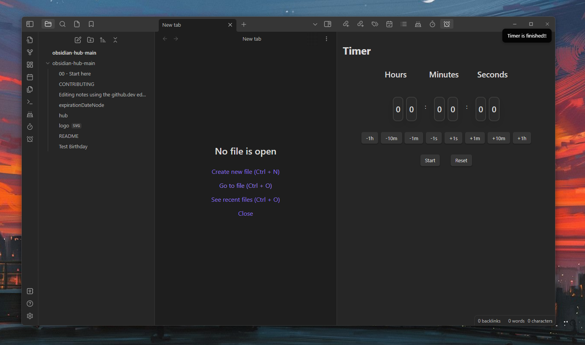
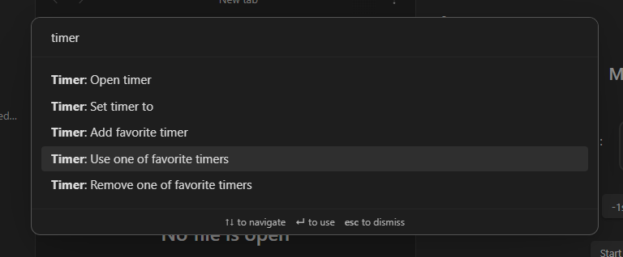
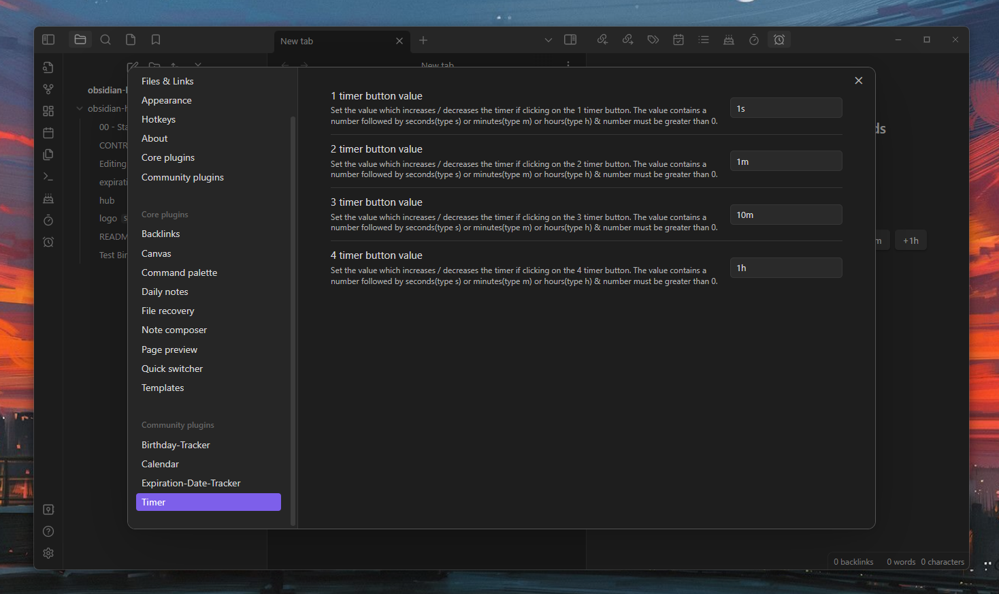

# Obsidian-Timer-Plugin

With this plugin you can measure time, set timers and get a notice if the timer is done.



## Using
Set your timer via commands or with the timer buttons under the clock. The maximum is ``99:59:59``. Also if the clock is at ``00:00:00`` the timer is not starting. You can edit the numbers which in-/decreases the clock in the settings. If the timer is finished you get a notice. You can ``start/stop/cancel/resume and reset`` the timer. By default you can start and reset the timer, but if the timer is going you can cancel/stop/resume it.

## Commands 
You can open the timer by clicking on the ribbon icon or using the command ``Timer: Open timer``. You can also directly set the timer via the command ``Timer: Set timer to``. You can use one of those two notation as input: 
```
HH:MM:SS or HHh MMm SSs
```
With those you can do this for example: 
```
10:11 for 10 minutes and 11 seconds
```
or 
````
10m 11s for 10 minutes and 11 seconds
````
Also you can add a couple of favorite timers, which you often use. You can remove them or choose one of them to insert into the timer. With that you don´t need to set the timer to the same times over and over again. Just select one of those favorites and your good to go.



## Settings
You can set the numbers of the timer buttons in the settings. Also you can insert only seconds/minutes or hours for one button. The number you insert gets an increasing and decreasing button.

